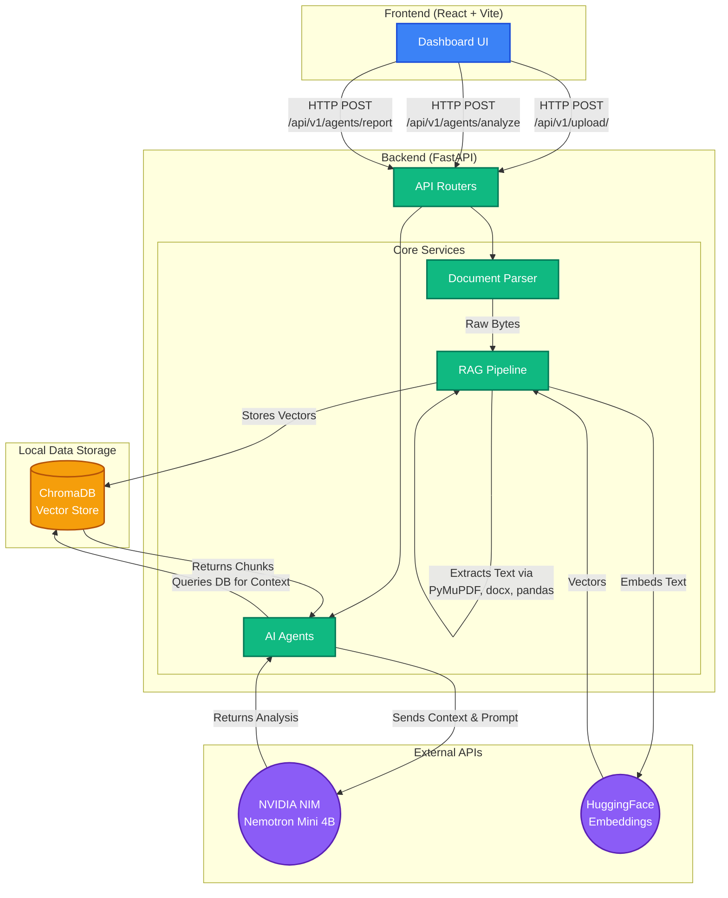

# System Architecture: AI Due Diligence Platform

This document outlines the architecture and technology stack of the AI Due Diligence Platform. The application follows a modern client-server architecture, utilizing a React frontend and a FastAPI backend with a fully integrated Retrieval-Augmented Generation (RAG) pipeline.

## High-Level Architecture Diagram

## Component Breakdown

### 1. Frontend (Client)
- **Framework**: React 19 + Vite.
- **Styling**: Pure CSS with CSS variables, Glassmorphism design patterns, and Dark Mode integration.
- **Components**: 
  - `Sidebar.jsx`: Navigation.
  - `UploadView.jsx`: Drag-and-drop ingestion interface handling `multipart/form-data`.
  - `AgentView.jsx`: Chat interface for domain-specific agent interrogation.
  - `ReportView.jsx`: Displays JSON-parsed Risk Scores and renders long-form Markdown Executive Reports.

### 2. Backend API (Server)
- **Framework**: FastAPI (Python).
- **Middleware**: Configured with CORS to allow cross-origin requests from the React development server.
- **Routers**:
  - `/upload/`: Receives files as raw bytes and delegates to the parser.
  - `/agents/analyze`: Accepts an agent type (Financial, Legal, Compliance, Risk Scoring) and a query.
  - `/agents/report`: A specialized endpoint that executes a broad vector search and synthesizes an Executive Report.

### 3. Core Services

#### Document Parser (`services/parser.py`)
Handles binary streams from the upload endpoint and converts them to raw text without saving intermediate files to the disk.
- **PDF**: Uses `PyMuPDF` (`fitz`).
- **Word (DOCX)**: Uses `python-docx`.
- **Excel (XLSX)**: Uses `pandas` to read sheets into CSV-formatted strings (ideal for LLM context).

#### RAG Pipeline (`services/rag.py`)
Responsible for chunking, embedding, and storing document context.
- **Text Splitter**: Langchain `RecursiveCharacterTextSplitter`.
- **Embedding Model**: `HuggingFaceEmbeddings` utilizing the `all-MiniLM-L6-v2` local model.
- **Vector Database**: `ChromaDB`, configured to store data persistently in `backend/chroma_db/`.

#### AI Agents (`services/agents.py`)
Acts as the orchestration layer between the Retrieval system and the LLM.
- **Model**: `ChatNVIDIA` utilizing the `nvidia/nemotron-mini-4b-instruct` model hosted on NVIDIA NIM endpoints.
- **Output Parsing**: Utilizes Langchain's `JsonOutputParser` specifically for the Risk Scoring agent to enforce a strict JSON schema (`score`, `risk_level`, `reasons`).
- **Cross-Analysis**: Modifies the RAG `k` parameter to retrieve a larger number of chunks when cross-referencing information across multiple documents.
